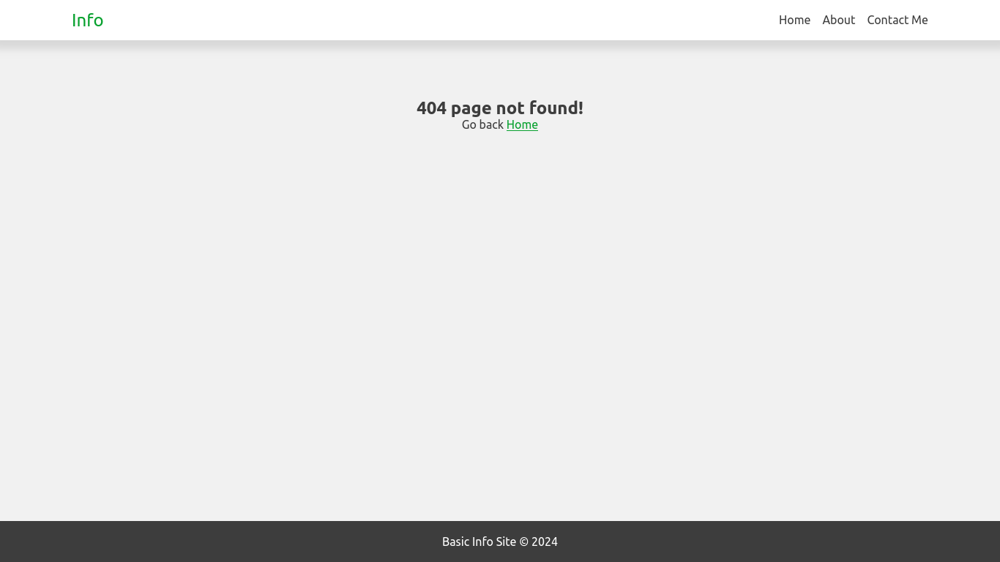

# Basic Info Site

My first Node.js project.



### Run app

Install Node.js

```bash
    cd basic-info-server
    node server
```
Open URL [http://localhost:8080](http://localhost:8080) in your browser.